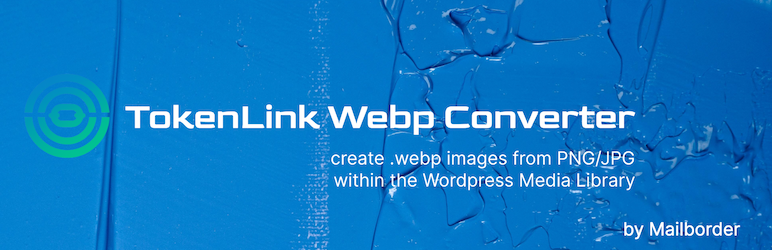
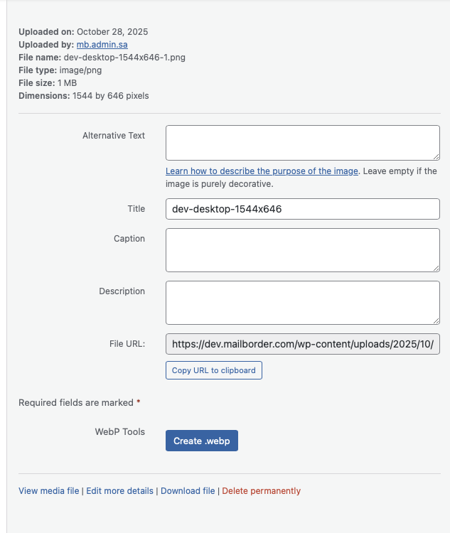
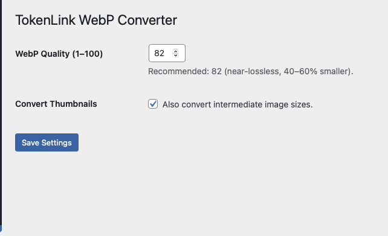

  <picture>
    <source media="(min-width: 768px)" srcset="assets/banner-1544x500.png">
    
  </picture>

# TokenLink WebP Converter

Generate `.webp` versions of JPEG and PNG images directly from the WordPress Media Library — without altering your site content.  
Safe, simple, and fast. Uses **Imagick** (preferred) or **GD** as fallback.

---

**Contributors:** mailborder  
**Tags:** webp, image optimization, media library, imagick, gd  
**Requires at least:** 5.0  
**Tested up to:** 6.8  
**Stable tag:** 1.2.2  
**License:** GPL v3 or later  
**License URI:** [https://www.gnu.org/licenses/gpl-3.0.html](https://www.gnu.org/licenses/gpl-3.0.html)

---

## Description

**TokenLink WebP Converter** adds one-click controls to your WordPress Media Library so you can:

- Create `.webp` versions of existing `.jpg` and `.png` images.  
- Delete the original images after conversion (optional).  
- Automatically register generated `.webp` files in the Media Library.  

No content rewrites, no background daemons, and no heavy frameworks — this plugin operates entirely within WordPress core standards.

### Features

- ✅ Uses **Imagick** if available, with GD fallback.  
- ✅ Single-file plugin — lightweight and portable.  
- ✅ No JavaScript or CSS dependencies.  
- ✅ Secure AJAX requests with nonces.  
- ✅ Configurable WebP quality (default 82).  
- ✅ Optional thumbnail conversion.

### Security

- All AJAX operations are nonce-protected.  
- Only authenticated users with proper permissions can trigger conversions or deletions.  
- No filesystem writes occur outside of the WordPress uploads directory.

### Ideal For

- Site owners who want to convert existing images to `.webp` without changing post content or URLs.  
- Developers who prefer a clean, auditable plugin over complex optimization suites.

---

## Installation

You can install **TokenLink WebP Converter** in three ways:

### 1. From the WordPress Plugin Directory
1. In your WordPress admin panel, go to **Plugins → Add New**.  
2. Search for **TokenLink WebP Converter**.  
3. Click **Install Now**, then **Activate**.  

### 2. Upload the ZIP File Manually
1. Download the latest release from [GitHub](https://github.com/jcbenton/tokenlink-webp-converter).  
2. In WordPress, go to **Plugins → Add New → Upload Plugin**.  
3. Choose the downloaded ZIP file and click **Install Now**.  
4. Click **Activate Plugin** once installation completes.  

### 3. Copy the Plugin Manually
1. Download or clone the repository from [GitHub](https://github.com/jcbenton/tokenlink-webp-converter).  
2. Extract and upload the `tokenlink-webp-converter` folder to `/wp-content/plugins/`.  
3. Go to **Plugins → Installed Plugins** in WordPress and click **Activate**.  

Once activated:
- Visit **Settings → TokenLink WebP** to configure image quality and options.  
- Open any image in the Media Library and click **“Create .webp”** to generate WebP versions.

📘 More details and documentation:  
[https://www.mailborder.com/tokenlink-webp-converter/](https://www.mailborder.com/tokenlink-webp-converter/)

---

## Frequently Asked Questions

### Does this plugin rewrite image URLs or modify post content?
No. It only generates and registers `.webp` images. Your posts, pages, and HTML remain untouched.

### Where are the WebP images stored?
In the same directory as the original image, e.g. `/uploads/2025/10/image.webp`.

### Can I safely delete the original files?
Yes. The **Delete Original** button is only available when a valid `.webp` version exists. It requires double-click confirmation before deletion.

### Do I need Imagick installed?
No. The plugin automatically falls back to the GD library if Imagick is not available.

### Will this affect new uploads?
No. TokenLink WebP Converter only acts on existing media items that you manually convert.

---

## Screenshots

### 1. Media Library Integration  
Easily create and delete WebP versions of your images directly from the Media Library attachment view.  
   

  
    

### 2. Settings Page  
Configure global options such as WebP quality and whether to convert intermediate (thumbnail) image sizes.  
   

---

## Changelog

### 1.2.2
- Added full in-admin AJAX integration for Create/Delete operations.  
- Added dynamic UI refresh and double-click confirmation for deletions.  
- Added detailed documentation and security hardening.

### 1.2.0
- Introduced Create/Delete controls in the Media Library.  
- Added AJAX processing and nonce validation.

### 1.0.1
- Initial plugin scaffold generated using TokenLink Constructor.

---

## License

This plugin is licensed under the [GNU General Public License v3](https://www.gnu.org/licenses/gpl-3.0.html).  
You are free to use, modify, and distribute it under the same license.

---

## Author & Project Links

- **Author:** [Mailborder](https://www.mailborder.com)  
- **Plugin Page:** [https://www.mailborder.com/tokenlink-webp-converter/](https://www.mailborder.com/tokenlink-webp-converter/)  
- **GitHub Repository:** [https://github.com/jcbenton/tokenlink-webp-converter](https://github.com/jcbenton/tokenlink-webp-converter)